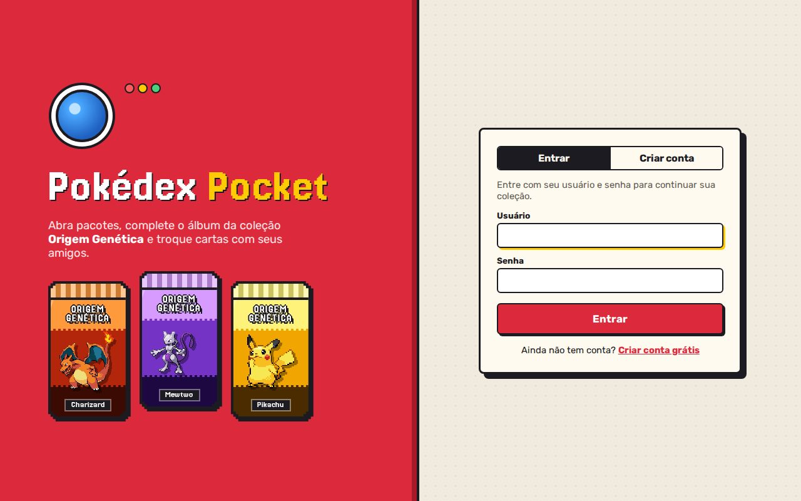
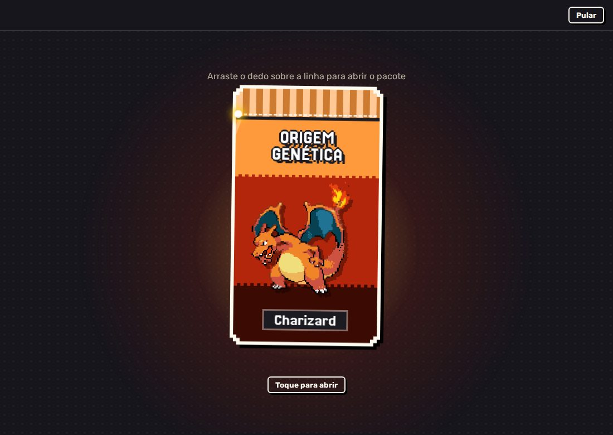
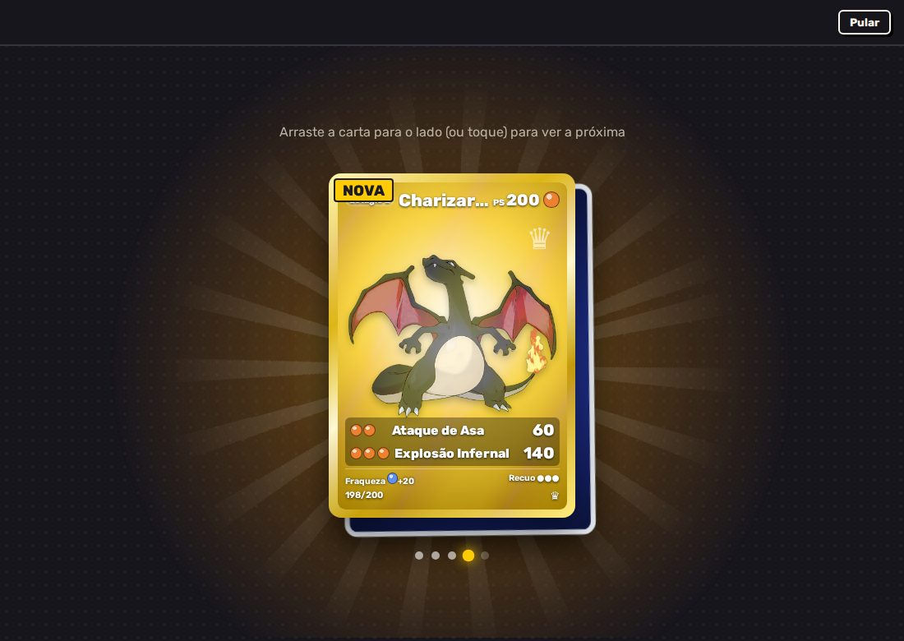
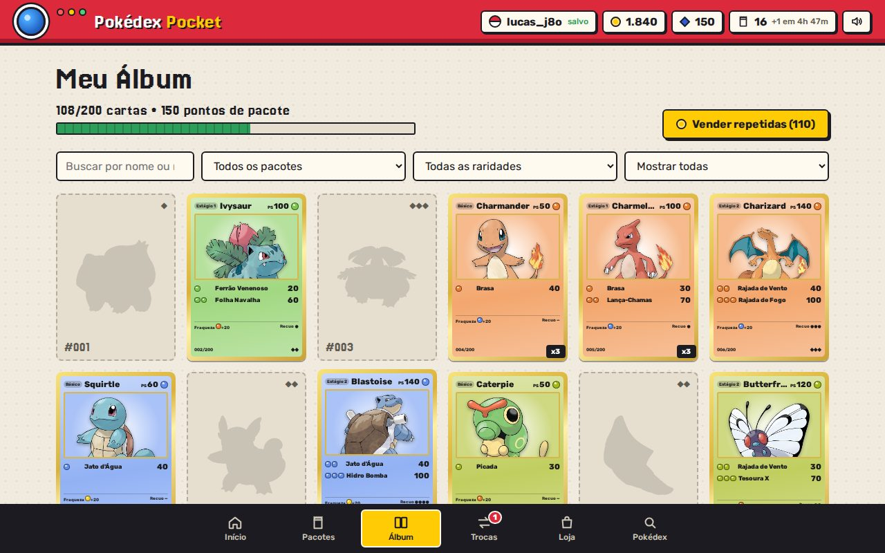
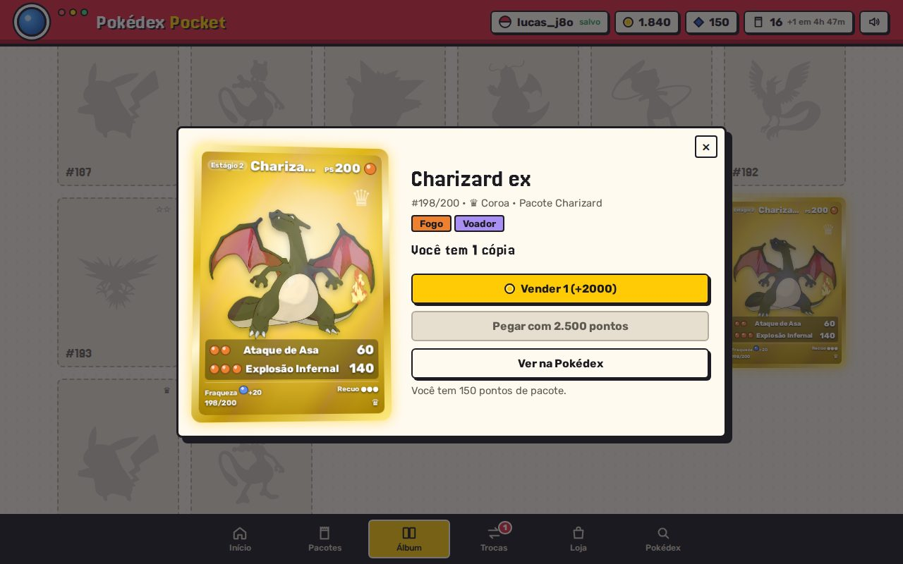
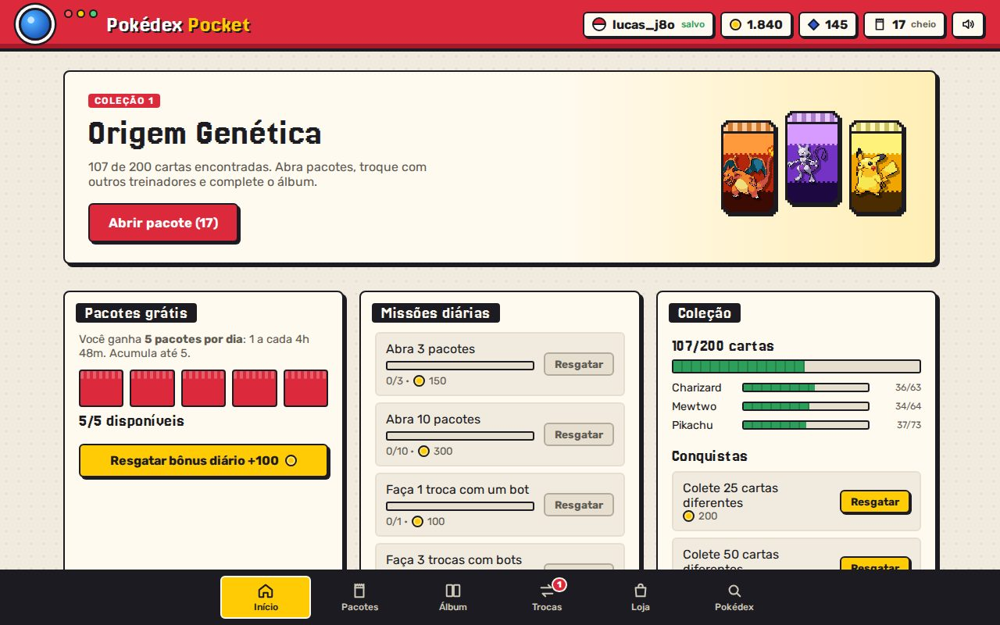
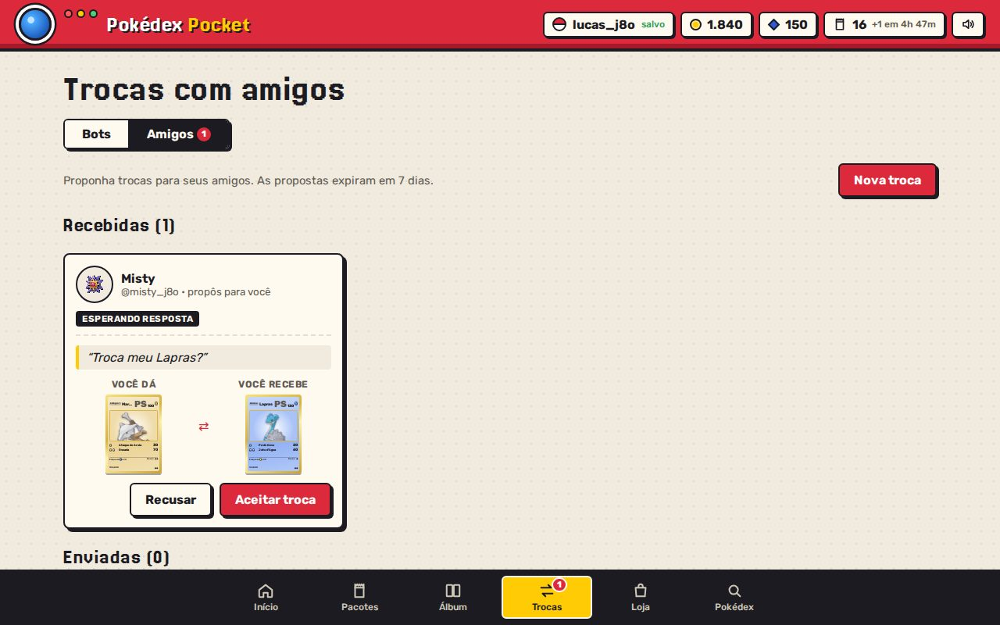
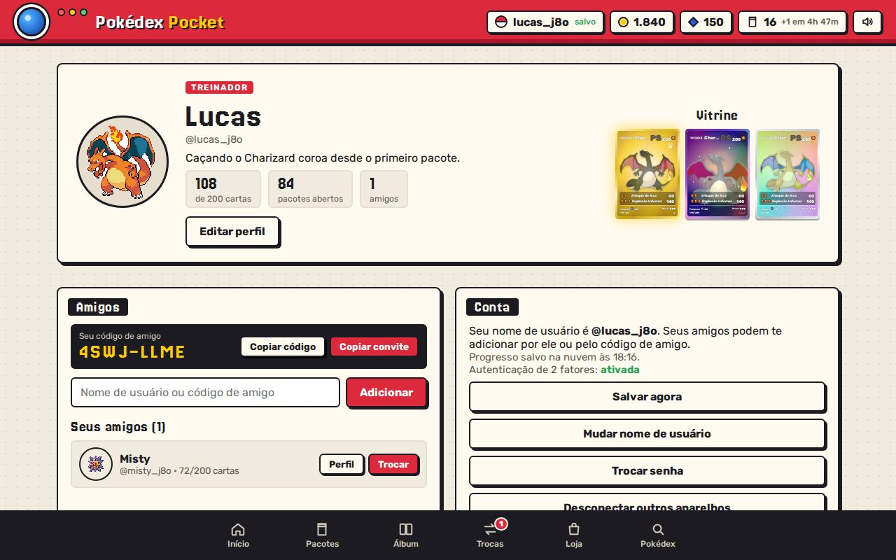
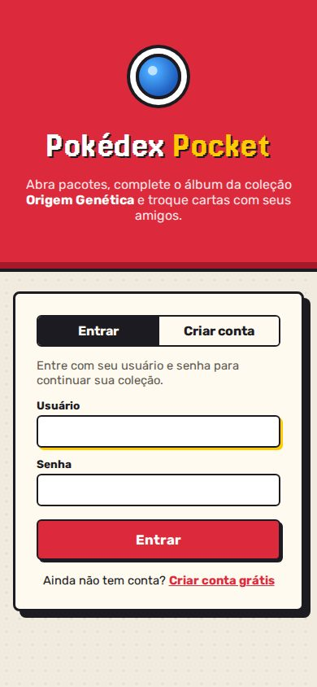

# Pokédex Pocket

Um jogo de colecionar cartas Pokémon que roda no navegador. Você abre pacotes, completa o álbum e troca cartas com os amigos, meio no estilo do Pokémon TCG Pocket.

**Para jogar: [pokepalword.vercel.app](https://pokepalword.vercel.app/)**



## De onde veio

Esse projeto começou como a minha primeira Pokédex em JavaScript, um desafio que o Yan Dias me passou no Discord: buscar um Pokémon pelo nome ou número na PokeAPI, mostrar a imagem, os tipos e as evoluções, e favoritar os preferidos. Foi ali que aprendi `fetch`, `async/await`, manipular o DOM e salvar coisas no `localStorage`.

Depois resolvi transformar a Pokédex num jogo de verdade. A busca original continua lá, numa aba própria, mas agora o foco são as cartas.

## Como é o jogo

Cada conta ganha 5 pacotes grátis por dia (um a cada 4h48). Tem as 11 expansões da Série A (Origem Genética, Ilha Mítica, Embate Espaço-Tempo, Bosque de Eevee e as outras), com 17 pacotes diferentes. Por enquanto só entram Pokémon da 1ª geração, inclusive as formas de Alola em Guardiões Celestiais. Você corta o pacote arrastando o dedo, as cartas saem de dentro dele e você vai passando para o lado, uma de cada vez. Quando vem carta rara, ela aparece virada e o fundo acende na cor da raridade.

<p>
  
  
</p>

O álbum tem 725 cartas, separadas por expansão, do ◆ comum até a ♛ coroa, com silhueta nas que faltam. As mais raras têm arte completa e brilho holográfico quando você passa o mouse.

<p>
  
  
</p>

Carta repetida dá para vender por moedas e usar na loja (tem até uma caixa com 25 pacotes), ou guardar para trocar. Os bots trazem ofertas novas a cada 2 minutos. Também dá para trocar com amigos: você escolhe cartas do seu álbum e do álbum da outra pessoa, manda uma mensagem e espera ela aceitar.

<p>
  
  
</p>

Cada jogador tem um perfil com apelido, avatar, bio e uma vitrine com 3 cartas. Os amigos se adicionam pelo nome de usuário, por um código curto (tipo `K7QM-3XPA`) ou por um link de convite.

<p>
  
  
</p>

Na tela inicial também tem o **Pokéclicker**, um mini game de clicar inspirado no Cookie Clicker e no Click the Button. Você clica no Pikachu para juntar energia e contrata ajudantes elétricos (Magnemite, Voltorb, Electabuzz... até Zapdos) que produzem sozinhos, inclusive com o jogo fechado. A loja vai liberando dezenas de melhorias, cada 100 cliques soltam um baú com itens colecionáveis de várias raridades, pokébolas especiais aparecem na tela com efeitos surpresa e tem mais de 60 conquistas. Chegando na meta de energia dá para **evoluir**: a partida recomeça, mas você ganha Pedras de Evolução para uma árvore de melhorias permanentes. Com a árvore completa, abre o Mercado de Pacotes, onde as pedras viram pacotes do jogo de cartas (até 5 por dia).

## Conta e segurança

Só dá para jogar com conta. O progresso fica salvo na nuvem, então dá para continuar no celular ou em outro computador.

Na hora de criar a conta, a verificação em duas etapas é obrigatória: você escaneia um QR code no Google Authenticator (ou Authy, Microsoft Authenticator) e recebe 8 códigos de recuperação para o caso de perder o celular.

No servidor, a senha é guardada com hash (scrypt), cada código do app só vale uma vez e a conta trava por 15 minutos depois de 5 erros seguidos. Também tem limite de tentativas por IP. Trocar a senha desconecta os outros aparelhos.

Nas trocas, as cartas oferecidas ficam reservadas até a resposta, então ninguém consegue oferecer a mesma carta duas vezes. Se a troca for recusada, cancelada ou passar de 7 dias, as cartas voltam.

Um limite que ainda existe: moedas e pacotes são calculados no navegador. Quem manja de programação consegue editar o próprio progresso. O servidor barra dados inválidos, mas não sabe se uma carta foi ganha de verdade. Para resolver isso eu teria que levar a abertura de pacotes para o servidor.

## Tecnologias

- HTML, CSS e JavaScript puro no front, sem framework
- [PokeAPI](https://pokeapi.co/) para os dados e as imagens dos Pokémon
- Vercel Functions (Node.js) no back-end, na pasta `api/`
- Postgres no [Neon](https://neon.tech/) para contas, amigos e trocas

## Organização do código

```
index.html            página do jogo
css/style.css         visual (cartas, pacotes em pixel art, animações)
Js/pokemon-data.js    dados dos 151 Pokémon
Js/cards.js           monta as cartas de todas as expansões
Js/packs.js           sorteio das cartas de cada pacote
Js/state.js           progresso, moedas, pacotes grátis e missões
Js/trades.js          ofertas dos bots
Js/conta.js           login, 2FA e sincronização com a nuvem
Js/social.js          perfil, amigos e trocas entre jogadores
Js/clicker-dados.js   regras e números do Pokéclicker
Js/clicker.js         telas do Pokéclicker
Js/main.js            telas e navegação
api/                  servidor (cadastro, login, save, social)
scripts/              servidor local e testes
```

## Rodando no seu computador

Precisa de Node.js 20 ou mais novo e de um Postgres.

```bash
npm install
cp .env.example .env.local   # preencha DATABASE_URL e SESSION_SECRET
npm run dev                  # abre em http://localhost:3000
npm test                     # com o servidor ligado, roda os testes
```

## Publicando na Vercel

1. Importe o repositório na Vercel (Application Preset: Other, sem build).
2. Em Storage, crie um banco Neon e conecte ao projeto. A `DATABASE_URL` aparece sozinha.
3. Em Settings → Environment Variables, crie `SESSION_SECRET` com um texto aleatório de pelo menos 32 caracteres. Dá para gerar um no console do navegador com `crypto.randomUUID() + crypto.randomUUID()`.
4. Faça um Redeploy. As tabelas do banco são criadas no primeiro acesso.

O endereço antigo no GitHub Pages redireciona automaticamente para o jogo na Vercel.

## Agradecimentos

Ao Yan Dias pelo desafio que começou tudo, ao Everton Dev pelo vídeo que me ajudou a entender o `localStorage` e ao Artigo Tech pelo conteúdo sobre a PokeAPI.

Pokémon e todos os nomes relacionados são marcas da Nintendo, Game Freak e The Pokémon Company. Este é um projeto de fã, sem fins lucrativos.
